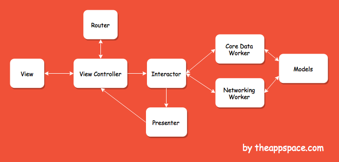

# Clean-Swift

- A app that display realtime traffic information and quote

Traffic information
- Refer web: https://data.gov.tw/dataset/15221
- API: https://od.moi.gov.tw/MOI/v1/pbs
- Refer document: http://data.moi.gov.tw/MoiOD/default/pbs_readme.docx

Wisdom
- Refer web: https://theysaidso.com/api/
- API: http://quotes.rest/qod.json // To get the quote of the day use the following api call.

## Architecture

Clean Swift (VIP) Flow Diagram

### Models
The Models class will be related to each component, as you can see in the Flow Diagram. It will be of type struct and mostly it will contain Request, Response, and ViewModel structs.

For this example, let’s assume you are working with an API call on this scene. You will need the following structs:

- Request - parameters that need to be sent to the API request.
- Response - intercepts the response from the API and stores the appropriate data.
- ViewModel - everything that you need to show to the UI is stored here. For example, your API returns objects with 10 parameters, but you only need to show 4 of them.

### Router
The router takes care for the transition and passing data between view controllers.

There are two protocols declared:

1. Routing Logic Protocol - all the methods used for routing are kept under this protocol.
2. Data Passing Protocol - a protocol that contains the data that needs to be passed to the destination controller.

### Worker
The Worker component will handle all the API/CoreData requests and responses.

### Interactor
This is the "mediator" between the Worker and the Presenter.

The Interactor also contains two types of protocols like the Router:

1. Business Logic Protocol - declare all the Interactor methods in this protocol, so they can be available for use in the ViewController.
2. Data Store Protocol - all properties that should keep their current state are declared here. This protocol is mainly used in the Router to pass data between controllers.

### Presenter
Presenter will be in charge of the presentation logic. This component decides how the data will be presented to the user.

### ViewController
ViewController will communicate with the Interactor, and get a response back from the Presenter. Also, when there is a need for transition, it will communicate with the Router.

## Requirments

- XCode 10.2+
- Swift 5.0+

## Notes

- Code less. Test more.
- Clean Swift iOS Architecture for Fixing Massive View Controller
- As Uncle Bob pointed out, group and file names should reveal your intentions for the use cases. It should not reflect the underlying framework structure. So we’ll organize each use case under a new group nested within Scenes.

## References

- [Introducing Clean Swift Architecture (VIP)](https://hackernoon.com/introducing-clean-swift-architecture-vip-770a639ad7bf)
- [Installing the Clean Swift Template in Xcode](https://medium.com/swift2go/installing-the-clean-swift-template-in-xcode-6b4367006827)
- [Uncle Bob's clean architecture](https://blog.cleancoder.com/uncle-bob/2012/08/13/the-clean-architecture.html)
- [Clean swift ios architecture](https://clean-swift.com/clean-swift-ios-architecture/)
- [Clean swift handbook](https://clean-swift.com/handbook/)
- [Swift-MVP-Sample](https://github.com/powerwolf543/Swift-MVP-Sample)
